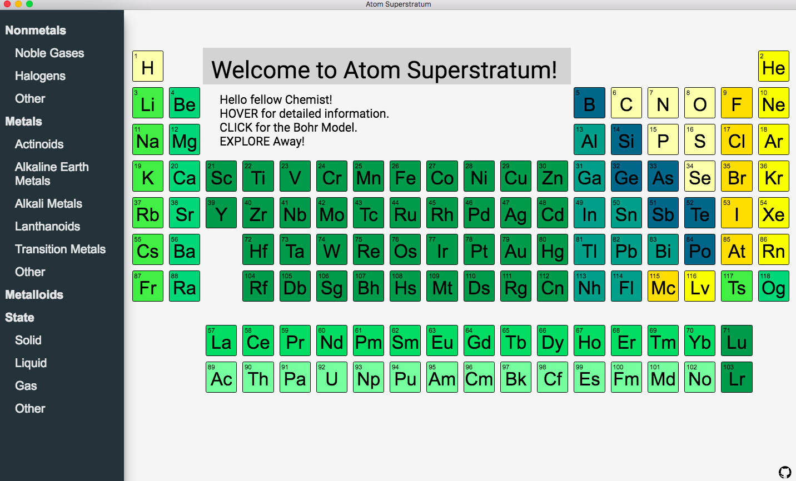
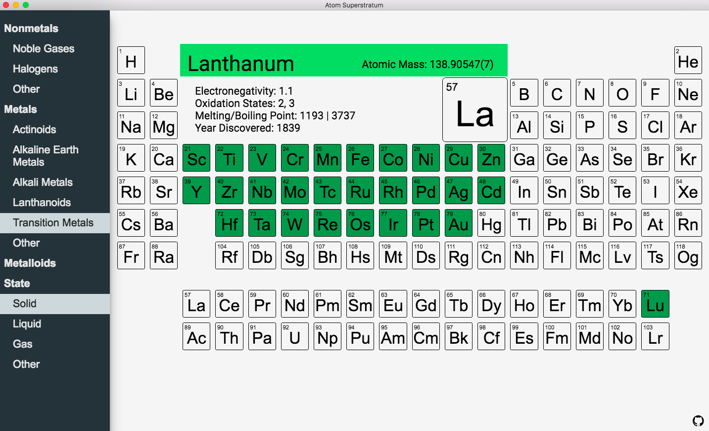
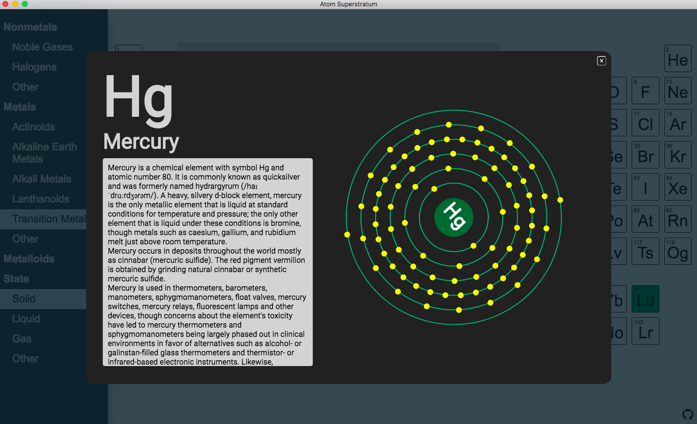

Atom Superstratum

Interactive Periodic Table is a fully encompassed interactive desktop educational tool where users can interact with and learn from the Periodic Table!

You can see detailed information upon hovering over the element, as well as, select filters to add colors to elements that share the same states and group.

You can click on the element to view more information and an animated Bohr Model.

Technology:

- HTML/CSS
- JSON File
- Angular2
- Typescript
- Electron

